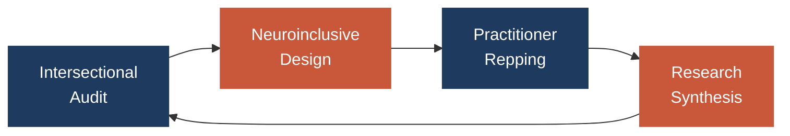

<!--
  Repped Labs — README
  Drop this in the root of your GitHub repo as README.md
  Search for <!-- TODO --> markers to swap in real values
-->

<div align="center">


<p><i>Building neuroinclusive, intersectional futures inside the workplaces that need them most.</i></p>

<p><sub>Founded by <a href="https://github.com/drteresavasquez"><b>Dr. Teresa Vasquez</b></a> &nbsp;&middot;&nbsp; <a href="https://github.com/TrinityChristiana"><b>Trinity Christiana</b></a></sub></p>

<p>
  
  
  
  
  
</p>

<p>
  <a href="#-what-is-repped-labs">About</a> ·
  <a href="#-whats-in-this-repo">Repo Map</a> ·
  <a href="#-frameworks">Frameworks</a> ·
  <a href="#-for-learners-in-the-lab">For Learners</a> ·
  <a href="#-how-to-contribute">Contribute</a>
</p>

</div>

---

## 🧭 What is Repped Labs?

**Repped Labs is a scholar-practitioner organization designing neuroinclusive workplaces — with intersectionality at the center, not the margins.**

We don't separate research from practice. The work we publish is the work we're doing inside organizations, and the work we're doing inside organizations is the work we're studying. That integration is the point.

> **The thesis:** Most "inclusion" work in tech treats neurodivergence and racial / gender / class identity as separate checklists. They aren't. People live at the intersections. Spaces built for the intersections are better for everyone.

<details>
<summary><b>Why "Repped"?</b></summary>
<br>

The name carries two meanings we hold simultaneously:

- **Representation** — who is in the room, who is heard, whose ways of working are treated as default vs. accommodation
- **Reps** — the iterative, embodied practice of building inclusive systems. You don't get good at this by reading about it. You get good at it by repping it.

Both meanings refuse the framing of inclusion as a finished destination.

</details>

---

## 📦 What's in this repo?

This is where the **templates, code, and working artifacts** of the lab live. It's a working repository, not a showcase — expect things in progress, drafts, and notebooks that are mid-thought.

```
repped-labs/
├── frameworks/        ← conceptual scaffolds and rubrics we use in the field
├── templates/         ← reusable docs (workshop facilitation, audits, intake)
├── notebooks/         ← analysis, data exploration, research notebooks
├── code/              ← scripts, utilities, prototypes
├── research/          ← lit reviews, working papers, dissertation drafts
└── learners/          ← onboarding materials for technologists in the lab
```

<details>
<summary><b>Repo conventions (click to expand)</b></summary>
<br>

- **Branches:** `main` is stable. Working drafts live in `wip/<short-name>` branches.
- **Naming:** lowercase, hyphenated. `neuroinclusive-hiring-audit.md`, not `Neuroinclusive Hiring Audit.md`.
- **Notebooks:** include a top-cell description of *what question this notebook is answering* before any code.
- **Templates:** every template ships with a short "when to use this" header and a worked example.
- **Citations:** APA 7 in research/, inline links elsewhere.

</details>

---

## 🧩 Frameworks

The lab's work organizes around a few core frameworks. Each one is a working document — refined as we use it in the field.



The cycle is intentional: practice generates research questions, research refines practice, and neither runs ahead of the other.

<details>
<summary><b>1. Intersectional Audit</b></summary>
<br>

Diagnostic tools for surfacing how race, gender, neurotype, and class compound inside specific organizational structures — hiring loops, performance reviews, meeting norms, promotion criteria.

📂 See: `frameworks/intersectional-audit/`

</details>

<details>
<summary><b>2. Neuroinclusive Design</b></summary>
<br>

Design patterns and anti-patterns for workplace systems, drawn from the disability-justice principle that *accommodations made for the margin improve the experience at the center.*

📂 See: `frameworks/neuroinclusive-design/`

</details>

<details>
<summary><b>3. Practitioner Repping</b></summary>
<br>

Facilitation guides, workshop templates, and rituals for teams actually doing the work. The point isn't to know — it's to practice.

📂 See: `templates/practitioner-repping/`

</details>

<details>
<summary><b>4. Research Synthesis</b></summary>
<br>

Lit reviews, working papers, and the integration layer between field practice and academic publication.

📂 See: `research/`

</details>

---

## 🧪 For learners in the lab

If you're a technologist learning alongside us — welcome. The lab treats learning as a first-class output, not a side effect.

<details>
<summary><b>👋 Start here (click to expand)</b></summary>
<br>

1. Read [`learners/orientation.md`](./learners/orientation.md) <!-- TODO: create this file -->
2. Skim the four frameworks above — you don't need to master them, just know what they're for
3. Find an open issue tagged [`good-first-rep`](../../issues?q=label%3Agood-first-rep) — these are scoped for newcomers
4. Show up. Ask. Make mistakes in the open. That's the lab.

</details>

<details>
<summary><b>🧰 What you'll learn here</b></summary>
<br>

Depending on what you bring and what you reach for:

- **Research methods** — qualitative coding, survey design, participatory research, data viz
- **Python & data work** — cleaning real organizational data, NumPy / pandas, light statistics
- **Facilitation craft** — running workshops where nobody performs neurotypicality
- **Writing for two audiences at once** — practitioners and peer reviewers
- **Critical frameworks** — intersectionality, disability justice, organizational power

</details>

<details>
<summary><b>📐 How we work</b></summary>
<br>

- **Short cycles.** We rep — we don't wait for perfect.
- **Documented thinking.** If it's not written, it didn't happen. Notebooks, decision logs, weekly notes.
- **Generous pushback.** Disagreement is part of the work. Bring receipts.
- **Care as default.** Pace is sustainable. Rest is not a reward, it's a requirement.

</details>

---

## 🛠️ Quick start

```bash
# Clone
git clone https://github.com/<your-org>/repped-labs.git   # TODO: real URL
cd repped-labs

# Set up Python (3.10+ recommended)
python -m venv .venv
source .venv/bin/activate            # Windows: .venv\Scripts\activate
pip install -r requirements.txt      # TODO: add requirements.txt

# Run the orientation notebook
jupyter lab notebooks/orientation.ipynb   # TODO: create this notebook
```

<details>
<summary><b>Dependencies</b></summary>
<br>

| Tool | Version | Why |
|------|---------|-----|
| Python | 3.10+ | Modern type hints, pattern matching |
| Jupyter Lab | latest | Notebook environment |
| NumPy / pandas | latest | Data work |
| matplotlib / seaborn | latest | Visualization |

<!-- TODO: trim or expand as the actual stack solidifies -->

</details>

---

## 🤝 How to contribute

This is a working lab — contributions are welcome, but the bar is *thoughtfulness*, not credentials.

<details>
<summary><b>Ways to contribute</b></summary>
<br>

- **Open an issue** describing a pattern you've seen, a critique of a framework, or a question
- **Submit a PR** with a new template, a refined framework, or improved documentation
- **Share a case** (with permission and care) from your own organizational work
- **Cite us, push us, disagree publicly** — the field gets better when the conversation is loud

</details>

<details>
<summary><b>Contribution principles</b></summary>
<br>

1. **Credit generously.** If an idea came from someone, name them — especially if they're from a community whose contributions get erased.
2. **Write for the next person, not the last person.** Documentation is care work.
3. **Surface assumptions.** Especially the ones that feel like common sense.
4. **Small reps > heroic commits.** A tight, well-scoped PR beats a 2,000-line rewrite.

</details>

---

## 📚 Citing this work

If you reference Repped Labs frameworks, templates, or analysis in published work, please cite us — and reach out before reproducing or adapting any materials:

```bibtex
@misc{reppedlabs,
  author       = {Vasquez, Teresa and Christiana, Trinity and Repped Labs},
  title        = {Repped Labs: Neuroinclusive, intersectional workplace design},
  year         = {2026},
  howpublished = {\url{https://github.com/<your-org>/repped-labs}}
}
```
<!-- TODO: confirm org URL -->

---

## 📜 License &amp; intellectual property

**All contents of this repository — code, frameworks, templates, research, and written work — are the intellectual property of Repped Labs.** © 2026 Repped Labs. All rights reserved.

This repository is shared publicly for **transparency, learning, and conversation**. Publication here does **not** constitute a grant of license to use, copy, modify, distribute, or create derivative works.

<details>
<summary><b>What this means in practice</b></summary>
<br>

- ✅ **Read it, learn from it, cite it.** Public scholarship and conversation are welcome.
- ✅ **Quote short excerpts** with attribution for review, commentary, or academic discussion.
- ❌ **Don't copy frameworks, templates, or code into your own products, decks, or workshops** without written permission.
- ❌ **Don't train models on this repository** without written permission.
- 🤝 **Want to use something?** Reach out. We're often glad to collaborate, license, or co-design — the answer is almost never "no" when the ask is made directly.

</details>

<!-- TODO: add a contact email / form link for licensing inquiries -->

---

<div align="center">

<sub>
  Built in the open by <b>Repped Labs</b> · Nashville, TN · <a href="#-what-is-repped-labs">↑ back to top</a>
</sub>

</div>
