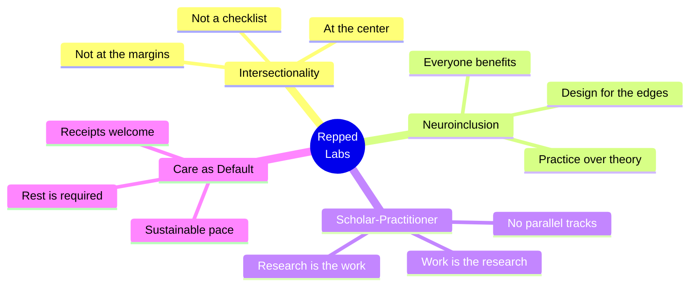

<div align="center">


<h3><i>This is the lab. Welcome in.</i></h3>

<p><sub>Founded by <a href="https://github.com/drteresavasquez"><b>Dr. Teresa Vasquez</b></a> &nbsp;·&nbsp; <a href="https://github.com/TrinityChristiana"><b>Trinity Christiana</b></a></sub></p>

<p>
  
  
  
</p>

</div>

---

<div align="center">

## 👋 &nbsp; Hey there.

</div>

You've found **Repped Labs** — a scholar-practitioner organization designing neuroinclusive, intersectional workplaces.

We don't separate the research from the work. The thinking we publish *is* the thinking we're doing inside organizations, and vice versa. That integration is the whole point.

This repo is where some of that thinking lives in the open.

---

<div align="center">

## 🧭 &nbsp; How we roll

</div>



<br>

<div align="center">

<table>
<tr>
<td align="center" width="33%">

### 🔬
**We rep, we don't wait for perfect.**
<sub>Short cycles. Documented thinking. Try it in the field before it gets a name.</sub>

</td>
<td align="center" width="33%">

### 🧠
**Intersectionality is the floor, not the ceiling.**
<sub>Race, gender, neurotype, and class compound. We build for the compounding.</sub>

</td>
<td align="center" width="33%">

### 💛
**Care is infrastructure.**
<sub>Pace is sustainable. Rest is not a reward. Disagreement is part of the work.</sub>

</td>
</tr>
</table>

</div>

---

<div align="center">

## 🌐 &nbsp; Where to find us

</div>

<div align="center">

<!-- TODO: swap in real URLs for any of these you actually use -->

[](https://example.com)
[](https://linkedin.com)
[](mailto:hello@example.com)

</div>

---

<details>
<summary><b>&nbsp;🪪 &nbsp; A quick note on what's here (and what isn't)</b></summary>

<br>

This repo is a working space. You'll find templates, code, notebooks, and drafts — some polished, some mid-thought. We share publicly for transparency and conversation, not as a finished product.

If something looks half-built, it probably is. That's the lab.

</details>

---

## 📚 Citing this work

If you reference Repped Labs frameworks, templates, or analysis in published work, please cite us — and reach out before reproducing or adapting any materials:

```bibtex
@misc{reppedlabs,
  author       = {Vasquez, Teresa and Christiana, Trinity and Repped Labs},
  title        = {Repped Labs: Neuroinclusive, intersectional workplace design},
  year         = {2026},
  howpublished = {\url{https://github.com/<your-org>/repped-labs}}
}
```
<!-- TODO: confirm org URL -->

---

## 📜 License &amp; intellectual property

**All contents of this repository — code, frameworks, templates, research, and written work — are the intellectual property of Repped Labs.** © 2026 Repped Labs. All rights reserved.

This repository is shared publicly for **transparency, learning, and conversation**. Publication here does **not** constitute a grant of license to use, copy, modify, distribute, or create derivative works.

<details>
<summary><b>What this means in practice</b></summary>
<br>

- ✅ **Read it, learn from it, cite it.** Public scholarship and conversation are welcome.
- ✅ **Quote short excerpts** with attribution for review, commentary, or academic discussion.
- ❌ **Don't copy frameworks, templates, or code into your own products, decks, or workshops** without written permission.
- ❌ **Don't train models on this repository** without written permission.
- 🤝 **Want to use something?** Reach out. We're often glad to collaborate, license, or co-design — the answer is almost never "no" when the ask is made directly.

</details>

<!-- TODO: add a contact email / form link for licensing inquiries -->

---

<div align="center">

<sub>
  Made with care by <b>Repped Labs</b> · Nashville, TN
</sub>

</div>
